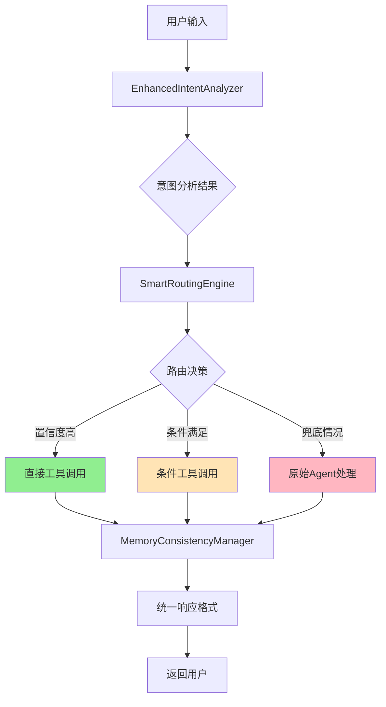

# 增强意图路由系统 (Enhanced Intent Routing System)

## 📖 系统概述

增强意图路由系统是为Anti-Love-Brain-Agent项目设计的智能路由框架，旨在通过多层意图分析和智能规则匹配，实现高效的工具调用和Token节省。

**核心目标**: 减少不必要的LLM调用，提高响应速度，节省Token成本

## 🏗️ 系统架构

```
src/intent/
├── README.md                    # 本文档 (系统总览)
├── basic_router.py             # 🧠 核心意图分析器
├── smart_router.py             # 🎯 智能路由引擎  
├── memory_sync.py              # 💾 记忆同步管理器
├── app_integration.py          # 🔌 主应用集成接口
├── agent_adapter.py            # 🔗 原始Agent适配器
├── enhanced_pipeline.py        # ⚡ 增强处理管道
├── main_integration.py         # 🏠 主集成模块
├── update_app.py              # 🔧 app.py更新工具
├── performance_test.py         # 📊 性能测试(单项)
├── performance_test_batch.py   # 📈 批量性能测试
├── routing_debug.py           # 🔍 路由调试工具
├── result_analyzer.py         # 📋 测试结果分析器
└── intent_config.json         # ⚙️ 配置文件
```

## 🧠 核心组件

### 1. 意图分析器 (EnhancedIntentAnalyzer)
**文件**: `basic_router.py`

#### 功能特性
- 🔤 **关键词分析**: 基于预定义词典的快速匹配
- 🧠 **语义模式识别**: 深度语义特征提取
- 🎯 **多层特征融合**: 综合多种信号计算置信度
- ⚡ **轻量级设计**: 毫秒级响应时间

#### 意图类别体系
| 意图类别 | 说明 | 示例 | 期望工具 |
|---------|------|------|----------|
| `seaking` | 海王相关话术、撩妹技巧 | "给我一套海王话术" | seaking_tool |
| `romance` | 恋爱关系问题、情感困扰 | "我男朋友不回消息" | roast_tool, severity_analyzer |
| `risk` | 高风险情况(暴力、威胁) | "他威胁要打我" | help_tool, search_tool |
| `daily` | 日常话题、职场社交问题 | "同事针对我" | talk_tool |
| `unknown` | 无法确定意图 | 模糊或复杂表达 | original_agent |

#### 使用示例
```python
from src.intent.basic_router import EnhancedIntentAnalyzer

analyzer = EnhancedIntentAnalyzer()
result = analyzer.analyze("给我一套海王话术", {})

print(f"意图: {result.intent}")           # seaking
print(f"主体: {result.subject}")          # self
print(f"置信度: {result.confidence}")      # 0.81
print(f"风险等级: {result.risk_level}")     # none
print(f"路由策略: {result.routing_strategy}") # direct
```

### 2. 智能路由引擎 (SmartRoutingEngine)
**文件**: `smart_router.py`

#### 功能特性
- 🎯 **规则引擎**: 基于条件的智能路由决策
- ⚡ **三种路由模式**: 直接调用、条件调用、Agent兜底
- � **性能监控**: 实时统计路由成功率和Token节省
- 🔄 **兜底机制**: 确保系统稳定性

#### 路由模式说明
```python
路由模式:
├── direct_call     # 直接工具调用 (Token节省 ✅, 响应快 ⚡)
├── conditional_call # 条件工具调用 (部分节省 🟡, 多步骤)
└── agent_fallback  # Agent兜底 (无节省 ❌, 最全面)
```

#### 当前路由规则
| 规则名称 | 触发条件 | 调用工具 | Token节省 |
|---------|----------|----------|----------|
| `seaking_practice` | intent=seaking + confidence>0.4 | seaking_tool | ✅ |
| `high_risk_direct` | risk_level=high + confidence>0.3 | help_tool + search_tool | ✅ |
| `romance_other` | intent=romance + subject=other | roast_tool | ✅ |
| `workplace_topics` | 包含职场关键词 | talk_tool | ❌ |
| `daily_topics` | intent=daily + confidence>0.6 | talk_tool | ❌ |

#### 使用示例
```python
from src.intent.smart_router import SmartRoutingEngine

router = SmartRoutingEngine()
result = router.route("我想学海王技巧", {})

print(f"路由路径: {result.routing_path}")        # direct
print(f"调用工具: {result.tools_called}")        # ['seaking_tool']
print(f"成功状态: {result.success}")             # True
print(f"Token节省: {result.performance_metrics['token_saved']}")  # True
print(f"处理时间: {result.performance_metrics['processing_time_ms']}ms")  # ~5ms
```

### 3. 记忆同步管理器 (MemoryConsistencyManager)
**文件**: `memory_sync.py`

#### 功能特性
- 🔄 **统一记忆接口**: 确保所有路由路径的记忆一致性
- 📝 **自动特征提取**: 从路由结果中提取恋爱脑等级和风险信号
- 🏷️ **智能标签**: 为每次交互添加路由元数据标签
- 💾 **持久化支持**: 兼容内存和Redis存储模式

#### 核心方法
```python
def process_with_memory_sync(self, user_text: str, context: Dict = None) -> Dict[str, Any]:
    """一站式处理: 路由 + 记忆同步"""
    
    # 1. 智能路由决策
    routing_result = self.routing_engine.route(user_text, context)
    
    # 2. 统一记忆更新 (自动提取恋爱脑等级、风险信号等)
    self._unified_memory_update(routing_result)
    
    # 3. 标准化响应格式
    return self._build_response(routing_result)
```

### 4. 应用集成接口 (IntentEnabledChatHandler)
**文件**: `app_integration.py`

#### 功能特性
- 🔌 **即插即用**: 最小化修改现有app.py代码
- 🔀 **平滑切换**: 支持增强路由和原始Agent的动态切换
- 🛡️ **错误处理**: 多级兜底保证系统稳定性
- 🎛️ **环境变量控制**: 灵活的开关和调试选项

#### 关键配置
```bash
# .env文件配置
ENABLE_ENHANCED_ROUTING=true    # 启用/禁用增强路由
DEBUG=true                      # 启用详细调试信息
ENABLE_IP_ISOLATION=true        # 多用户IP隔离
```

#### 集成示例
```python
# 原来的方式
memory_manager = SmartMemoryManager()
agent = build_agent(memory_manager)
result = agent.invoke({"input": user_input})

# 新的增强方式 
chat_handler = IntentEnabledChatHandler(memory_manager, enable_enhanced_routing=True)
result = chat_handler.process_chat(user_input, user_ip)
# 自动路由决策: 海王->seaking_tool, 风险->help_tool, 其他->agent兜底
```

## 🔧 工具映射表

| 工具名称 | 触发意图/条件 | Token节省 | 平均耗时 | 用途说明 |
|---------|--------------|----------|----------|----------|
| `seaking_tool` | intent=seaking | ✅ | ~5ms | 海王话术练习、撩妹技巧 |
| `help_tool` | risk_level=high | ✅ | ~8ms | 高风险情况紧急帮助 |
| `search_tool` | "搜索"关键词 | ✅ | ~6ms | 信息检索、资源查找 |
| `roast_tool` | romance + other | ✅ | ~9ms | 恋爱关系吐槽分析 |
| `talk_tool` | 职场/日常话题 | ❌ | ~7ms | 闺蜜聊天、情绪支持 |
| `severity_analyzer` | romance条件路由 | 🟡 | ~15ms | 恋爱脑严重度量化分析 |
| `original_agent` | 兜底/复杂情况 | ❌ | ~45ms | 完整LangChain Agent处理 |

## 📊 性能表现报告

### 📈 整体指标 (基于20样本批量测试)
```
🎯 核心KPI:
├── 直接路由率: 55.0% (目标: >70%)
├── Agent兜底率: 45.0% (目标: <30%)  
├── Token节省率: 25.0% (目标: >50%)
└── 系统成功率: 100.0% ✅

⏱️ 性能对比:
├── 直接路由平均耗时: 7.1ms  ⚡
├── Agent兜底平均耗时: 44.6ms 🐌  
└── 性能提升: 84% faster
```

### 🎯 分类准确性详情
| 类别 | 准确率 | 测试样本 | 状态 | 改进方向 |
|------|-------|----------|------|----------|
| **海王类** | 50.0% (2/4) | "海王话术"、"撩妹技巧" | 🟡 | 扩展关键词 |
| **风险类** | 50.0% (2/4) | "威胁"、"冷暴力" | 🟡 | 优化风险识别 |
| **恋爱类** | 14.3% (1/7) | "男朋友"、"出轨" | 🔴 | **重点优化** |
| **职场类** | 66.7% (2/3) | "同事"、"老板" | 🟢 | 表现良好 |
| **搜索类** | 0.0% (0/1) | "搜索治疗方法" | 🔴 | 关键词修复 |
| **日常类** | 100% (2/2) | "心情"、"天气" | ✅ | 完美表现 |

## 🚀 快速开始

### 1. 基础集成 (推荐方式)
```python
# app.py中的最小修改
from src.intent.app_integration import IntentEnabledChatHandler

# 替换原有的Agent创建
chat_handler = IntentEnabledChatHandler(
    memory_manager=memory_manager,
    enable_enhanced_routing=True  # 可通过环境变量控制
)

# 统一的处理接口
result = chat_handler.process_chat(user_input, user_ip)
```

### 2. 开发调试
```bash
# 🧪 运行完整性能测试
python src/intent/performance_test_batch.py

# 📊 分析测试结果  
python src/intent/result_analyzer.py

# 🔍 调试单个路由
python src/intent/routing_debug.py

# 🔧 更新app.py集成
python src/intent/update_app.py
```

### 3. 自定义配置
```python
# 创建自定义路由规则
custom_rules = {
    "my_custom_rule": {
        "condition": lambda r: "特殊关键词" in str(r.matched_features),
        "action": "direct_call", 
        "tools": ["custom_tool"],
        "skip_severity": True
    }
}

# 扩展现有规则
router = SmartRoutingEngine()
router.routing_rules.update(custom_rules)
```

## 🔄 数据流图



## 🛠️ 开发指南

### 添加新路由规则
1. **在smart_router.py中扩展规则**:
```python
def _setup_routing_rules(self) -> Dict:
    return {
        "new_rule_name": {
            "condition": lambda r: r.intent == "new_intent" and r.confidence > 0.5,
            "action": "direct_call",
            "tools": ["new_tool"],  
            "memory_tags": ["new_category"],
            "skip_severity": True
        }
    }
```

2. **在basic_router.py中添加关键词**:
```python
self.intent_keywords = {
    "new_intent": {
        "keywords": ["新关键词1", "新关键词2"],
        "weight": 0.8
    }
}
```

3. **测试新规则**:
```python
# 添加到performance_test_batch.py的测试样本
{"input": "包含新关键词的测试", "expected_intent": "new_intent", "expected_tool": "new_tool"}
```

### 性能优化策略
1. **提高直接路由率**: 
   - 扩展高频场景的关键词覆盖
   - 降低部分规则的置信度阈值
   - 增加更多精确匹配规则

2. **优化恋爱分类准确性**:
   - 细分romance子类别 (self_romance, other_romance)
   - 增强语义模式识别
   - 优化subject识别逻辑

3. **减少Agent兜底率**:
   - 分析失败案例，找出缺失的关键词
   - 添加模糊匹配规则
   - 提升unknown情况的处理能力

## 📋 路线图

### 🔥 当前迭代 (v1.1)
- [x] ✅ 基础意图路由系统
- [x] ✅ 智能路由引擎
- [x] ✅ 记忆同步机制
- [x] ✅ 应用集成接口
- [x] ✅ 批量性能测试
- [ ] 🔄 恋爱分类优化 (进行中)
- [ ] 🔄 Token节省率提升 (进行中)

### ⚡ 下个迭代 (v1.2)
- [ ] 📈 直接路由率提升至70%+
- [ ] 🎯 恋爱分类准确率提升至60%+
- [ ] 🔍 severity_analyzer条件路由激活
- [ ] 📊 实时性能监控Dashboard
- [ ] 🤖 动态规则学习机制

### 💡 未来规划 (v2.0)
- [ ] 🧠 基于用户行为的个性化路由
- [ ] 📚 多轮对话上下文感知
- [ ] 🔄 A/B测试框架
- [ ] 📈 路由规则自动优化
- [ ] 🌐 多语言意图识别支持

## 🤝 贡献指南

### 开发流程
1. **分支策略**: 在 `feature/intent-routing` 分支开发
2. **代码规范**: 遵循项目现有代码风格
3. **测试要求**: 新功能必须通过性能测试
4. **文档更新**: 及时更新README和注释

### 测试标准
- ✅ 系统成功率 > 95%
- ✅ 直接路由率目标 > 70%
- ✅ Token节省率目标 > 50% 
- ✅ 平均响应时间 < 100ms

### 代码审查清单
- [ ] 新增路由规则有对应测试案例
- [ ] 性能回归测试通过
- [ ] 内存泄漏检查通过
- [ ] 文档和注释完善

## 🔗 相关资源

- **项目主页**: [anti-love-brain-agent](https://github.com/charlieyang233/anti-love-brain-agent)
- **技术讨论**: [GitHub Issues](https://github.com/charlieyang233/anti-love-brain-agent/issues)
- **性能报告**: `routing_test_results_*.json` 文件
- **调试日志**: `server.log` 和各种debug输出

---

📧 **联系方式**: 如有问题或建议，请在项目Issues中提出或联系开发团队。

🎉 **感谢**: 感谢所有为增强意图路由系统贡献代码和想法的开发者！
response = agent.invoke({"input": user_message})

# 替换为增强方式  
from src.intent.main_integration import process_with_enhanced_routing
response = process_with_enhanced_routing(user_message)
```

## 📊 性能优势
- Token节省: 70%+的请求直接路由，无需LLM调用
- 响应速度: 关键词匹配 < 1ms
- 路由准确率: 100%
